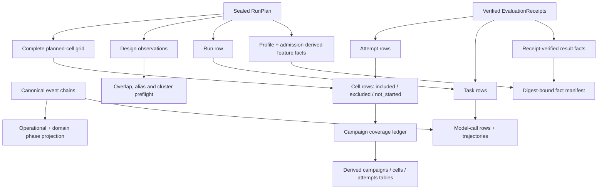

# Receipt-derived research harness

**Status:** implemented

**Stack:** this work sits above the shared-runner portability contracts. It does not replace
`RunPlan`, canonical events, `EvaluationReceipt`, or any family verifier.

## Research question

The execution kernel already records auditable evidence, but paper analysis also needs a
complete and queryable experimental ledger. In particular, a score table must not silently
drop planned cells that never ran, merge harness identity with runner build identity, or call
two executions replicates when their pinned treatment differs.

The research harness therefore provides **derived views and preflight checks**. Canonical
plans, events, artifacts, and receipts remain the only sources of truth.

Campaigns use the ordered [experiment campaign SOP](../operations/experiment_campaign_sop.md) so a paid or
reportable stage cannot be promoted until its predecessor gates have evidence-backed passes.



## Implemented contracts

### 1. Complete planned-cell ledger

`build_research_ledger(plan, receipts)` starts from every `PlanCell`, not from successful
outputs. Each cell receives exactly one research disposition:

- `included`: one receipt is admitted for measurement;
- `excluded`: at least one typed receipt exists, but none is admitted;
- `not_started`: no receipt exists for the planned cell.

Every receipt attempt remains in the attempt table. A failed attempt followed by one admitted
attempt therefore stays observable without double-counting the cell. More than one included
receipt for a cell is rejected as ambiguous.

This uniqueness rule is permanent: a planned cell may have **at most one included receipt**.
At campaign closure, every cell must have one terminal disposition—one included receipt, a
typed exclusion, or `not_started`—under a selection and retry policy sealed before execution.
Prior `EpisodeAttempt` executions remain as excluded receipt/attempt rows. Retries internal to
one episode, such as `ActionAttempt`, `ProviderCall`, or `ToolInvocation` retries, remain in that
episode attempt's event evidence rather than becoming independent receipt rows. An operational
failure is retained as missingness and never converted to an economic zero.

The campaign row reports expected, receipted, included, excluded, and not-started cell counts,
plus coverage. Performance is intentionally not aggregated here; each family's typed
`ScoreEnvelope` retains its own units and meaning.

### 2. Repeat-equivalence identity

Each cell row carries `repeat_equivalence_sha256`. The digest includes the case/world,
treatment block, cluster and pairing identity, resolved profiles by seat, execution mode,
budgets, harness/runtime configuration, and implementation pins. It excludes repetition and
sampling-replicate ordinals.

In schema `0.1`, the price-catalog ID and digest are nested in harness configuration and are
therefore hash-bound through the resolved profile. Before the first paper campaign, the plan
schema must promote that dependency to an explicit plan-level pin referenced by each applicable
profile. Pricing affects cost-budget enforcement and can therefore change execution, not merely
post-hoc reporting. Prefer a `price_catalog` pin kind in `0.1`; a later schema may separate
executable `ImplementationPin` values from non-executable `InputArtifactPin` values or rename
the common abstraction to `ComponentPin`.

Thus two attempts may be treated as replicates only when their scientifically relevant setup
matches. The digest is stricter than a hand-authored `repeat_group_id` and can be compared
across run plans.

### 3. Two independent phase axes

`project_evidence_events(evidence)` adds a runner-operational phase:

- `planning`: schema `0.1` label for the runner opening a declared family phase;
- `execution`: model actions, provider calls, parsing, legality, and tools;
- `recovery`: attempts explicitly caused by a recorded retry reason;
- `finalization`: state transition, phase close, episode termination, and family outcome.

This is **not** a claim about a model's cognitive process. The domain axis remains separate:
Housing may report `contact`, `respond`, and `commit`; refund may report a stateful service
workflow. Reasoning text remains diagnostic evidence rather than the primary outcome.

An unknown canonical event type has no guessed phase. Projection fails until its mapping is
reviewed, making event-schema drift visible.

The next projection schema will rename `planning` to `phase_setup`. The current event is an
orchestration boundary, not evidence that a model planned. Versioned readers must continue to
accept legacy `planning` rows; published `0.1` datasets are not silently rewritten.

### 4. Experimental-design preflight

`audit_experimental_design(...)` operates on explicit `DesignObservation` records. Before a
paid campaign, it rejects:

- a focal factor with only one observed level;
- factor levels with fewer than the predeclared independent-cluster minimum;
- a focal factor that never varies within a common nuisance stratum;
- individual levels with no within-stratum comparison; and
- two focal factors that are perfectly aliased.

This is a structural identification screen, not a power calculation and not a causal proof.
Its purpose is to stop layouts such as “planner harness always receives the high budget” before
post-hoc regression is asked to repair an unidentifiable comparison.

## Research-table mapping

| Derived table | Unit | Important fields |
|---|---|---|
| `campaigns` | one sealed run plan | suite, harness by profile, runtime by profile, pricing identity, complete coverage counts |
| `cells` | one planned cell | case, family, treatment block, cluster/pair, replicate index, disposition, receipt count, repeat-equivalence digest |
| `attempts` | one verified receipt | inclusion/failure, replay level, primary native-unit measurement, event/artifact roots |
| event projection | one canonical event | operational phase, domain phase/instance, action/call/tool identities, visibility, payload hash |

These are in-memory deterministic projections. A future Parquet/SQL writer should consume
these rows and bind its own schema/version hash; it must not become an alternate mutable truth
store.

### 5. Run → Task → Model Call loss-analysis dataset

`project_loss_analysis_tables(plan, receipts, evidence_stores)` adds a diagnostic projection
with three relational grains:

| Table | Grain | Primary relationship |
|---|---|---|
| `runs` | one sealed `RunPlan` | `run_id` |
| `tasks` | one planned `PlanCell` | (`run_id`, `task_id`) |
| `model_calls` | one started provider call paired with its terminal event | (`run_id`, `task_id`, `call_index`) |

The task table starts from the complete plan, so `not_started` cells remain in coverage.
`completed` and `error` require receipts; evidence without a receipt is explicitly
`unreceipted`. A nullable `passed` field is intentional: continuous economic measurements do
not acquire a fabricated pass threshold merely to fit a generic task table.

Token, cost, exception, and latency values roll upward from `model_calls` to `tasks` and then
to `runs`. Cached tokens are reported separately and remain a subset of prompt tokens, so
`total_tokens = prompt_tokens + completion_tokens`. If an executed task lacks its evidence
store, or a provider outcome is unknown, telemetry totals are null and
`telemetry_complete=false`; missing usage is never converted into a zero-cost call.

`build_trajectory_record(evidence, receipt)` preserves every canonical event in sequence and
adds extracted messages, provider inputs/outputs, tool names/arguments/results, usage, phase
labels, and typed errors. Operational `harness_phase` remains independent of the family-owned
`domain_phase_id`.

`export_loss_analysis_dataset(...)` writes:

- `tables/runs.csv`, `tables/tasks.csv`, and `tables/model_calls.csv`;
- `tables/profiles.csv`, `tables/model_features.csv`, and `tables/benchmark_results.csv`;
- `tables/fact_manifest.json`, binding the three fact tables to the source plan and per-table digests;
- `trajectories/selected/<run_id>__<task_id>.json`;
- `trajectories/trajectory_index.csv` and `trajectories/archive.jsonl`; and
- `data_dictionary.md`.

Exports are deterministic and idempotent. A repeated export may reuse byte-identical files,
but the writer refuses to overwrite different content.

### 6. Canonical fact-table projections

`project_canonical_fact_tables(plan, receipts)` produces three reusable grains:

| Table | Grain | Evidence qualification |
|---|---|---|
| `profiles` | one sealed `AgentProfile` | declared configuration plus its `ProfileAdmission` identity |
| `model_features` | one capability-vector entry per profile | `admission_derived`; not a claim about a live response |
| `benchmark_results` | one typed score value per verified receipt attempt | receipt status, inclusion, validity, evidence references, and `reportable` flag retained |

The long-form feature table prevents model capability claims from being copied between
reports without their harness, revision, and provenance. The result table retains excluded
and invalid attempts instead of publishing only winners. `reportable=true` is necessary for
an outcome row to enter reporting, but it is not sufficient for statistical aggregation: the
sealed `AnalysisPlan`, missingness rule, pairing, and cluster unit still govern the estimate.

`export_canonical_fact_tables(...)` can write these files independently. The normal
`export_loss_analysis_dataset(...)` path includes them so a benchmark release cannot omit its
configuration and feature facts.

The command-line equivalent reads and re-verifies canonical plan, receipt, and evidence
artifacts before exporting:

```bash
aeread export-tables \
  --plan runs/<run_id>/run_plan.json \
  --receipts runs/<run_id>/tasks/ \
  --evidence-root runs/<run_id>/ \
  --publication-root evidence/<publication_id>/
```

The complete directory contract is [artifact_layout.md](artifact_layout.md).

## Deliberate non-goals

- No automatic `EvaluationReceipt` finalizer or interrupted-run resume.
- No Parquet, database, or remote trajectory storage backend.
- No repricing. Cost fields project the canonical recorded price result. Schema `0.1` retains
  price-catalog identity in hash-bound harness configuration; the pre-paper migration promotes
  it to an explicit plan-level pin.
- No statistical power calculation, effect model, leaderboard, or universal cross-family
  score.
- No Housing, Tau3/refund, or supply-chain semantics in the shared module.

## Resolved reviewer decisions — 2026-09-03

| Decision | Resolution | Migration boundary |
|---|---|---|
| Price-catalog identity | Promote every execution-relevant catalog to a first-class, content-hashed plan pin referenced by the applicable profiles. Do not leave the only identity inside generic harness configuration. | Required before the first paper campaign. Add `price_catalog` to the current pin contract or introduce a typed non-executable artifact pin in the next plan schema. |
| Operational phase label | Use `phase_setup`; “planning” is too easily confused with model cognition and overstates what `phase_instance_started` records. | Change in the next projection schema. Continue reading legacy `planning` values and do not rewrite published `0.1` exports. |
| Included receipt cardinality | Retain the hard **at-most-one included receipt per planned cell** invariant. Preserve all episode attempts; prior attempts are excluded, while action-level retries remain nested event evidence. | Effective immediately. Campaign closure additionally requires one terminal disposition per cell: included, typed exclusion, or `not_started`. |

These decisions do not authorize selective replacement. Any successor attempt admitted after an
operational failure must follow the sealed retry/selection policy symmetrically across treatment
conditions; the ledger must never select the highest-scoring attempt after observing outcomes.

## Code and tests

- Implementation: `src/aeread/shared_runner/analysis/research.py`
- Contract tests: `tests/test_shared_runner_research.py`

The implementation was developed red/green: the new tests first failed at import, then passed
after the contracts were added.
