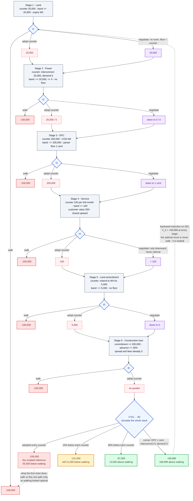
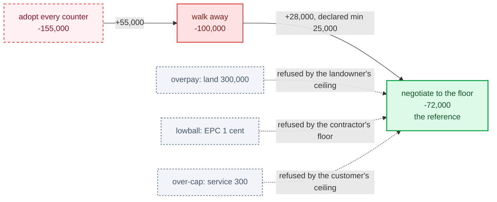

# The V2 full-stack case as a walk-away problem

**Status:** analysis record for DC-D-01, DC-D-04 and the repair in
`full_stack_amendment_002`. Every number below was produced by re-simulating
on `main` at `410e64fe` through `_baseline_stack(payload, "v2")`, patching the
scripted developer's terms and checking each proposal with
`terms_acceptable`; the two live probes are sealed under the session's run
roots and summarised in the [incident log](../../operations/incident_log.md).

**Profile:** [datacenter QC profile](qc.md) · **Cases:**
[`full_stack_amendment_001`](../../../cases/datacenter_development_v1/v2/full_stack_amendment_001.json)
(sealed, unchanged) and
[`full_stack_amendment_002`](../../../cases/datacenter_development_v1/v2/full_stack_amendment_002.json)
(repaired).

## 1. The recursion, with terms as the action

At each stage `k in {1 … 6}` the developer proposes a term vector `t_k`. The
counterparty runs `terms_acceptable`: every field at or above its minimum, at
or below its maximum, required conditions present — and accepts. Inside the
band there is no counter and no second round.

```
V_k(s_k)  = max { U_outside ,  max_{t_k in B_k} [ V_{k+1}(s_k ∪ {t_k}) ] }
V_7(t_1 … t_6) = NPV( revenue(t) − capex(t) − opex(t) − debt service(t) + terminal value )
B_k = { t : min_k <= t <= max_k }
```

Every discount rate in the case is zero, so NPV is a plain sum and `V_7`
moves one-for-one with each price term. The optimal policy is then trivial
to state — propose the developer-favourable edge of every band at every stage
— and whether that edge is *sensible* is the case design's job.

| | |
|---|---|
| state `s_k` | the stage index and the executed stack so far: land, power, EPC, service, land amendment, loan |
| levers open on `001` | EPC price (<= 200,000; parser floor 1 cent), interconnection (<= 20,000), demand charge (<= 5), extension fee (<= 5,000) |
| levers closed on `001` | service price capped at 100 by the customer's policy though its value is 200; land price floored at 20,000; COD fixed at month 4 by `built_capacity_kw_by_month = [0, 500, 500, 1000]` |
| outside option | −100,000 at every stage; an incomplete stack falls back to it |

## 2. The decision tree on the sealed case, all six stages, three moves each

The first draft of this chart drew each stage as walk away or proceed on the
scripted terms, and so concluded that the tree collapses. That was the
reference collapsing, not the case. Drawn with terms as the action, the tree
does not collapse: on `001` the best stack is 170,000 cents above walking
away — for a reason the case should not allow.



Read the two dotted edges together. The reference path loses to walking
away — that is DC-D-01 and it is still true. But the value of the *game* on
`001` is +69,999, because nothing in the case stops the developer from paying
the contractor one cent. In the published panel the models scored the outside
option not because walking was optimal, but because they copied the counter
or failed to act, which is the one thing that case cannot tell apart.

## 3. The value of the game at each stage, sealed case

Backward induction is deterministic here, so `V_k` along a fixed policy is
the terminal payoff if that payoff beats the outside option, and the outside
option otherwise.

| stage | adopt every counter | argmax | 15% below | 30% below | corner of bands | argmax |
|---|---:|---|---:|---:|---:|---|
| 7 · terminal | −155,000 | simulate | −121,000 | −87,000 | +69,999 | simulate |
| 6 · loan | −100,000 | walk | −100,000 | −87,000 | +69,999 | execute |
| 5 · land amendment | −100,000 | walk | −100,000 | −87,000 | +69,999 | execute |
| 4 · service | −100,000 | walk | −100,000 | −87,000 | +69,999 | execute |
| 3 · EPC | −100,000 | walk | −100,000 | −87,000 | +69,999 | execute |
| 2 · power | −100,000 | walk | −100,000 | −87,000 | +69,999 | execute |
| 1 · land | −100,000 | walk | −100,000 | −87,000 | +69,999 | execute |

A column that reads −100,000 all the way down is a policy under which the
rational move is to walk at stage 1; a constant column above −100,000 is a
policy worth executing to the end. This is what
`datacenter_development_v2_interaction_v1` measured: all four
model-by-condition groups scored −100,000 with `project_completion_rate 0.0`.
Read against the first column, the models found the optimal response to the
reference path. Read against the last, they left 169,999 on the table — and
the case cannot say which.

## 4. The outcome ladder on the sealed case, simulated

| developer policy | EPC price | interconnect | demand | developer NPV | vs walk | counterparty |
|---|---:|---:|---:|---:|---:|---|
| walk away | — | — | — | −100,000 | 0 | n/a |
| adopt every counter (scripted reference) | 200,000 | 20,000 | 5 | −155,000 | −55,000 | accepts |
| 15% below each counter (branch floor width) | 170,000 | 17,000 | 4 | −121,000 | −21,000 | accepts |
| EPC alone to the tie point | 145,000 | 20,000 | 5 | −100,000 | ±0 | accepts |
| 30% below each counter | 140,000 | 14,000 | 3 | −87,000 | +13,000 | accepts |
| corner of every band | 1 | 0 | 0 | +69,999 | +169,999 | accepts |
| service at the customer's value (probe) | 200,000 | 20,000 | 5 | −55,000 | +45,000 | rejects · cap 100 |
| land below the seller's floor (probe) | 200,000 | 20,000 | 5 | −145,000 | −45,000 | rejects · floor 20,000 |

Two things the ladder settles. A realistic amount of negotiation — 15% off,
the width the world-panel branch chose for its floors — is *not enough* to
make `001` worth playing: the economics gap is 55,000 and 15% of the open
levers is worth 34,000. And an unrealistic amount is unbounded, because the
counterparties have ceilings but no reservation.

## 5. What terminal value buys — the economics lever

Patching only `project_facts.terminal_value_cents` on the adopt-every-counter
path. Customer NPV is fixed at 100,000 throughout, so every cent passes to
the developer one-for-one.

| terminal_value_cents | developer NPV | total project NPV | vs walk | verdict |
|---:|---:|---:|---:|---|
| 0 (as-is) | −155,000 | −55,000 | −55,000 | dominated |
| 50,000 | −105,000 | −5,000 | −5,000 | dominated |
| 55,000 | −100,000 | 0 | ±0 | exact tie — still fails |
| 100,000 (10% of appraised value) | −55,000 | +45,000 | +45,000 | dominates |
| 150,000 | −5,000 | +95,000 | +95,000 | dominates |
| 200,000 | +45,000 | +145,000 | +145,000 | dominates |

On its own this fixes the reference's *number* and not what the reference
*is*: with terminal value at 100,000 and no floors, the corner of the bands
is still accepted and now pays +169,999. It was not used in the repair.

## 6. Why V2 broke when V0 and V1 did not

| version | COD | revenue months | added capital cost | baseline NPV | margin over walking | bands |
|---|---|---:|---|---:|---:|---|
| V0 · service + loan | month 3 | 2 | — | −20,000 | +80,000 | one-sided |
| V1 · + power, EPC | month 3 | 2 | power, EPC | −50,000 | +50,000 | one-sided |
| V2 · + land, amendment (`001`) | month 4 | 1 | land 20,000 · extension 5,000 · interconnect 20,000 | −155,000 | −55,000 | one-sided, no floors |
| V2.1 · objective bounded | month 4 | 1 | same, service repriced to 160 | −95,000 | +5,000 | zero-width: min = max |
| V2 repaired (`002`) | month 4 | 1 | same | −72,000 | +28,000 | two-sided |

The outside option stayed at −100,000 across every version while the project
got shorter and more expensive; nothing re-checked the pair. V2.1 is the tell
in both directions: the only identity that cleared the outside option, the
only one whose scorer enforced the check (`objective_measurement.py:198`), and
it did so by pinning every field `minimums == maximums` — which closes the
lowball hole by closing the band entirely, so copying the counter becomes
the only admissible stack (DC-D-03).

## 7. What a right case has to satisfy

| requirement | meaning | `001` | V2.1 | `002` |
|---|---|---|---|---|
| `V_floor > U_outside` | the case is worth playing | fails at 15%: −121,000 | holds: −95,000, by 5,000 | **holds: −72,000, by 28,000** |
| `V_floor − V_adopt` material | negotiation is measurable, not transcription | 34,000 at 15%, but unbounded | fails: spread 0 | **83,000** |
| `V_corner` bounded by a counterparty floor | no lowball hole; the counterparty has a reservation | fails: EPC at 1 cent accepted | holds trivially: min = max | **holds: floors 15% (EPC 8%)** |

`V_floor` is the scripted developer negotiating to the counterparty's floor;
`V_adopt` is copying every counter; `V_corner` is the developer-favourable
edge of the bands.

## 8. The repaired case, `002`

Two-sided bands: floors 15% below each counter (8% for EPC), ceilings at the
counter, and the customer's price ceiling opened to 160 against its value of
200. The scripted developer negotiates to the floor. An opt-in
`construct_controls` block makes `validate_payload` refuse the case unless
the reference strictly dominates the outside option by the declared margin
and every negotiated money term is bounded on both sides; switched on
against the sealed `001` payload the guard dies on both controls.

| policy on `002` | developer NPV | vs walk (−100,000) | counterparty |
|---|---:|---:|---|
| scripted reference, floor of every band | **−72,000** | **+28,000** (declared minimum 25,000) | accepts |
| adopt every counter | −155,000 | −55,000 — the trap the case now sets | accepts, admissible |
| land at 300,000 (Gemini's opening bid) | — | — | **rejects** |
| EPC at 1 cent (the old optimum) | — | — | **rejects** |
| service at 300 (Astra's demand) | — | — | **rejects** |



What `002` still does not do: it is one case, not an admission screen, so the
family's Gate 1 and Gate 3 stay `failed` in the profile; and the walk-away
and blind-adoption controls are still owed as *scored* policies, which is
what turns the table in section 7 from an authoring rule into Gate 3
evidence.

## 9. What the two live probes showed on `001`

Three seeds each, $1.10 in total, every cell sealed and replay-verified.

| model | opening land bid (quote 20,000) | what followed | score |
|---|---:|---|---:|
| Gemini 3.8 Flash | 300,000 / 100,000 / 200,000 | countered only because an unrelated field breached a ceiling; copied the counter verbatim on every agreement; never probed a price downward | −155,000 ×3 |
| GPT-6 Astra | 800,000 / 800,000 / 700,000 | one downward probe (interconnection 10,000) lost inside a bundle of out-of-band fields; demanded 300–350 from a customer capped at 100, conceded to 275–300, stranded the project | −100,000 ×3 |

Neither number describes what happened, and on `001` the model that failed
to close outscored the one that closed. That is DC-D-04, and it is why the
repair is bands and a floor-negotiating reference rather than a terminal
value alone.
